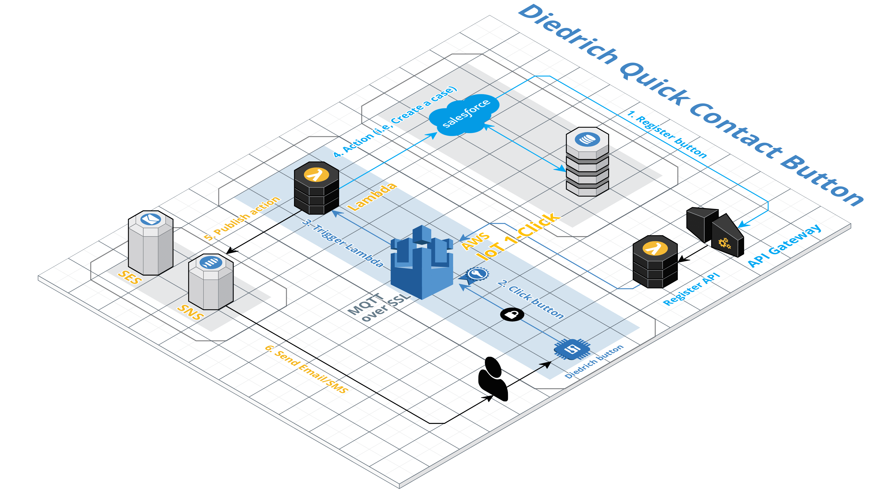

# Diedrich Quick Contact Button

Diedrich Quick Contact Button IoT 1-Click Service

## Architecture



## 1. Claim button

At first, we must claim buttons in AWS IoT 1-Click console.
Enter the device ID in the AWS IoT 1-Click mobile app or console to configure Wi-Fi and to claim the device. (Use device ID prefix: G030PM)

Note:
AWS IoT Enterprise Button is only available us-west-2 region (Orgeon)
AWS IoT 1-Click does not support AWS IoT buttons whose device serial numbers (DSN) begin with G030JF, G030MD, and G030PT.

## 2. Register button API Endpoint

  - **Gateway Info**

| Stage | Service Endpoint                                           | API Key                                  |
| ----- | ---------------------------------------------------------- | ---------------------------------------- |
| dev   | https://nxfhofubdg.execute-api.us-west-2.amazonaws.com/dev | 2Y8jjxENkL7476kQdVuI87W3LaZP4DH59juiHkFc |

<br/>

  - **Specification For Endpoint**
  
| Endpoint | Method | Path      | Auth Mode         | Description                      |
| -------- | ------ | --------- | ----------------- | -------------------------------- |
| register | POST   | /register | Private (API Key) | register a button in IoT 1-Click |

<br/>

- **Parameter requirements**

These parameters should be sent as key of JSON object

| Parameters | Description                       |
| ---------- | --------------------------------- |
| dsn        | DSN of button to register         |
| username   | Salesforce username or Account ID |
| email      | email of the button owner         |
| phone      | phone number of the button owner  |

<br/>

curl command for sample request to Register device endpoint
```
$curl -X POST -H "x-api-key: 2Y8jjxENkL7476kQdVuI87W3LaZP4DH59juiHkFc" -d '{"username":"stevenp@diedrichroasters.com","email":"stevenp@diedrichroasters.com","phone":"+12089200122","dsn":"G030PM046226FX9A"}' https://nxfhofubdg.execute-api.us-west-2.amazonaws.com/dev/register
```

content type is `application/json`
Even if you don't specify content type of the request, it should work well.